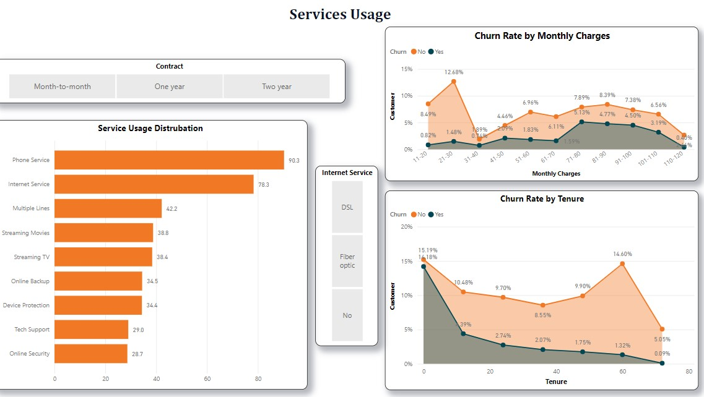
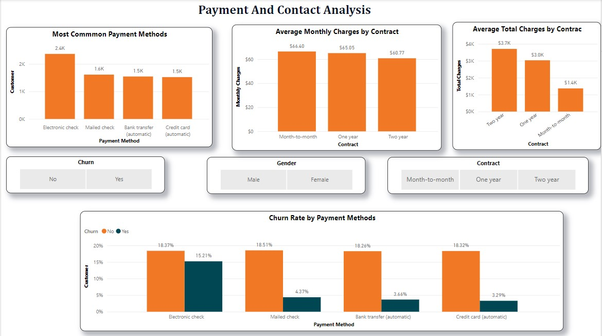

# Project Title: Telco Churn Analysis

A data analysis project focused on understanding customer churn in a telecommunications company. SQL was used for data cleaning and preparation, and Power BI was used to build interactive dashboards that identify key churn drivers and support the customer retention strategy.

---

## Table of Contents

- [Overview](#overview)
- [Dataset](#dataset)
- [Technologies Used](#technologies-used)
- [Installation](#installation)
- [Usage](#usage)
- [Analysis & Visualizations](#analysis--visualizations)
- [Conclusion](#conclusion)
- [Credits](#credits)
- [License](#license)

---

## Overview

- **Motivation:** Customer churn directly impacts revenue and growth in the telecom industry. This project was built to move beyond surface-level churn rates and uncover the specific behavioural and contractual patterns that drive customers to leave.
- **Objective:** To identify key factors contributing to customer churn (contract type, payment method, tenure, and service usage) and deliver interactive Power BI dashboards that enable data-driven retention decisions.
- **Learning Outcomes:** Strengthened SQL skills for data wrangling and transformation, deepened Power BI expertise in multi-page dashboard design, and developed practical experience translating churn data into actionable business recommendations.

---

## Dataset

- **Source:** Telco customer dataset (CSV)
- **Size:** 4,043 rows, 21 columns
- **Key Features/Columns Used:**

  **Demographic Information:**
  - CustomerID, Gender, Senior Citizen, Partner, Dependents

  **Service Information:**
  - Tenure, Phone Service, Multiple Lines, Internet Service, Online Security, Online Backup, Device Protection, Tech Support, Streaming TV, Streaming Movies

  **Contract and Payment Information:**
  - Contract Type, Payment Method, Monthly Charges, Total Charges, Churn (Yes/No)

- **Preprocessing:**
  - Checked for missing values: 11 rows had null `Total_Charges`, resolved by calculating `Tenure * Monthly_Charges`
  - Confirmed zero duplicate rows across all 21 columns
  - Checked numeric columns (Tenure, Monthly Charges, Total Charges) for outliers; none found
  - Created `Monthly_Charges_Bin` and `Total_Charges_Bin` columns using CASE logic for range-based analysis
  - Built a ranked `Service_Count` table to identify the most-used services by customer percentage
  - Exported a clean `Final_Churn` table for direct use in Power BI

---

<h2>Technologies Used</h2>

<ul>
  <li><strong>Languages:</strong> SQL (MS SQL Server)</li>
  <li><strong>Tools:</strong> Power BI, VS Code, Git, GitHub</li>
  <li><strong>Skills:</strong> Data Cleaning &amp; Transformation, Exploratory Data Analysis, KPI Design, Dashboard Development, Customer Segmentation, Analytical Storytelling</li>
</ul>

<p>
  
  
  
  
</p>

---

## Installation

```bash
# Clone the repository
git clone https://github.com/M-Bhurtel/Telco-Churn-Analysis.git

# Navigate to the project folder
cd Telco-Churn-Analysis
```

**To reproduce the SQL data preparation:**
1. Import `Telco_churn.csv` into MS SQL Server as a table named `Churn` inside a database named `Telco`
2. Run `Telco_churn_Data_Prepare.sql` sequentially to clean, transform, and export the final table

**To explore the dashboard:**
1. Open `Telco_Churn_Visualisation.pbix` in Power BI Desktop
2. Refresh the data source connection if prompted

> **Note:** Power BI Desktop is required to open the `.pbix` file. Download it free from [Microsoft](https://powerbi.microsoft.com/desktop/).

---

## Usage

Instructions for using the dashboard:

1. Open `Telco_Churn_Visualisation.pbix` in Power BI Desktop
2. Navigate across the three dashboard pages: **KPIs**, **Services Usage**, and **Payment and Contract Analysis**
3. Use the slicers (Senior Citizen, Gender, Contract Type, Internet Service, Churn) to filter visuals in real time
4. All charts and KPI cards update dynamically based on your selections

**Page 1: KPI Overview**


**Page 2: Services Usage**



**Page 3: Payment and Contract Analysis**



---

## Analysis & Visualizations

The project is structured across three Power BI dashboard pages:

**Page 1: KPIs**
- Overall churn rate stands at **26.54%** across 4,043 customers
- Average tenure is **32.37 months** and average monthly charges are **$64.76**
- Service subscription KPIs show Streaming Movies (38.79%) and Streaming TV (38.44%) as the most subscribed add-ons among churned segments
- Demographics reveal an almost equal gender split (Male 50.48% vs Female 49.52%), with 29.96% of customers having dependents

**Page 2: Services Usage**
- Phone Service has the highest adoption at **90.3%**, followed by Internet Service at **78.3%**
- Churn rate is highest in the **$61-$70 monthly charge range** (12.68% churn vs 8.49% retained)
- Tenure analysis shows churn is sharpest in the **first month** (15.19% churn) and drops significantly as tenure increases, confirming early-stage customers are the highest retention risk
- Customers on **month-to-month contracts** show dramatically higher churn than one-year or two-year contract holders

**Page 3: Payment and Contract Analysis**
- **Electronic check** is the most common payment method (2.4K customers) and carries the highest churn rate at **15.21%**, more than 4x higher than bank transfer (3.66%) or credit card (3.29%)
- Month-to-month contract customers have an average total charge of just **$1.4K** vs **$3.7K** for two-year contract holders, reflecting shorter customer lifespans
- Average monthly charges are consistent across contract types ($60.77-$66.40), meaning churn is driven by commitment level, not pricing

---

## Conclusion

- The analysis confirmed that **contract type, payment method, and early tenure** are the strongest predictors of churn in this telecom dataset
- **Key Insight:** Customers on month-to-month contracts paying via electronic check within their first 12 months represent the highest-risk churn segment and should be the primary target for proactive retention campaigns
- Offering incentives to shift customers from month-to-month to annual contracts, or from electronic check to automatic payment methods, could meaningfully reduce the 26.54% churn rate
- **Next Steps:** Build a churn prediction model using logistic regression or random forest on the cleaned dataset, and integrate a churn risk score directly into the Power BI dashboard for real-time monitoring

---

## Credits

- **Author:** Mohani Lal Bhurtel – [LinkedIn](https://www.linkedin.com/in/mohanibhurtel/)
- **Role:** Data Analyst | SQL | Power BI
- **Dataset Source:** [Telco Customer Churn Dataset](https://www.kaggle.com/datasets/blastchar/telco-customer-churn)
- **Contact:** [mohanilalbhurtel07@gmail.com](mailto:mohanilalbhurtel07@gmail.com)

---

## License

This project is licensed under the [MIT License](https://choosealicense.com/licenses/mit/) – feel free to use and modify it.

---

<p align="center"><strong>Thanks for visiting! 🚀</strong></p>
